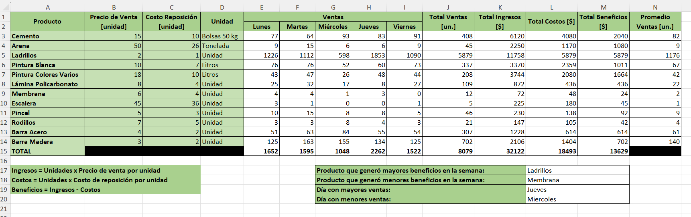

# 📊 Plantilla de Control de Ventas, Costos y Beneficios Semanales

Proyecto desarrollado en Microsoft Excel diseñado para la gestión comercial, control de costos de reposición y cálculo automatizado de márgenes de beneficio en negocios de distribución, construcción o ferreterías.

## 📂 Archivo del Proyecto
Puedes descargar el archivo `.xlsx` y utilizarlo o modificarlo según tus necesidades.

### Vista Previa de la Plantilla

## 🧮 Funciones y Operaciones Utilizadas

Esta plantilla automatiza completamente el análisis de rendimiento mediante el uso de fórmulas aritméticas esenciales y funciones estadísticas de Excel:

- **Suma (`SUMA`)**: Consolidación total de las unidades vendidas por día (Lunes a Viernes), ingresos globales de la semana, costos totales y los beneficios netos consolidados.
- **Multiplicación (`*`)**: 
  - Cálculo de **Total Ingresos [$]**: `Unidades Vendidas × Precio de Venta [unidad]`.
  - Cálculo de **Total Costos [$]**: `Unidades Vendidas × Costo de Reposición [unidad]`.
- **Resta (`-`)**: Determinación del **Total Beneficios [$]** mediante la diferencia directa de márgenes (`Ingresos - Costos`).
- **Promedio (`PROMEDIO`)**: Cálculo analítico de la media diaria de ventas para cada tipo de producto.
- **Máximos y Mínimos (`MAX` y `MIN`)**: Sección de KPI automatizada en la parte inferior para identificar de forma inmediata:
  - El producto que generó mayores y menores beneficios en la semana.
  - El día de la semana con mayor y menor volumen de ventas registrado.

## 📌 Objetivo

Proporcionar una herramienta centralizada y de aspecto profesional (diseño limpio en tonos verde sage) que permita a administradores y dueños de negocio evaluar en tiempo real el rendimiento de sus productos, mitigar el impacto de los costos de reposición y planificar el stock según las fluctuaciones de la demanda diaria.
