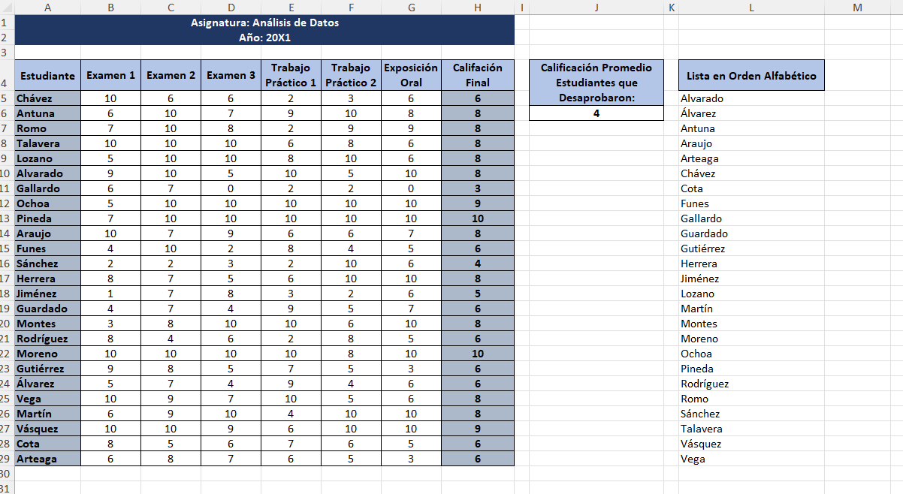

# 📊 Plantilla de Registro e Informe de Calificaciones Académicas

Proyecto desarrollado en Microsoft Excel diseñado para la gestión de notas, cálculo automatizado de promedios, control de aprobados/desaprobados y ordenamiento de listas en entornos educativos y académicos.

### Vista Previa de la Plantilla

## 📂 Archivo del Proyecto
Puedes descargar el archivo `.xlsx` y utilizarlo o modificarlo según tus necesidades.

## 📌 Objetivo

Ofrecer a docentes, coordinadores académicos e instituciones una herramienta limpia y de aspecto profesional (diseñada con una paleta en tonos azul marino y gris ejecutivo) que reduzca la carga administrativa manual, evite errores en los cálculos de promedios y proporcione estadísticas rápidas sobre el rendimiento general del grupo.
