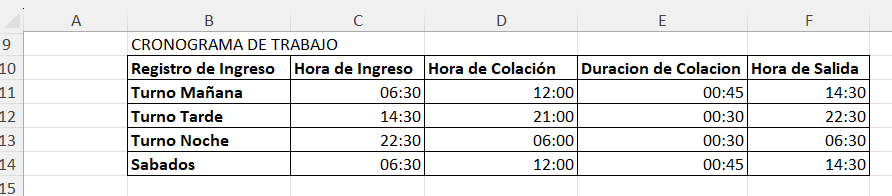

# 📊 Plantilla de Cronograma de Trabajo y Gestión de Turnos Laborales

Proyecto desarrollado en Microsoft Excel diseñado para la planificación, organización y control de horarios de personal en entornos operativos que manejan múltiples jornadas de trabajo y tiempos de descanso (colación).

### Vista Previa de la Plantilla

## 📂 Archivo del Proyecto
Puedes descargar el archivo `.xlsx` y utilizarlo o modificarlo según tus necesidades.

## 📌 Objetivo

Proporcionar a supervisores, jefes de planta y coordinadores de recursos humanos una herramienta simplificada, clara y de aspecto profesional que optimice la asignación de cuadrantes de trabajo, prevenga el solapamiento de horarios y garantice una correcta visualización de los descansos de los colaboradores.
