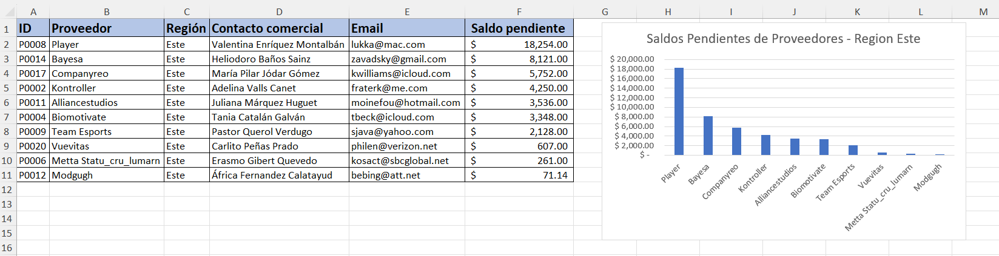
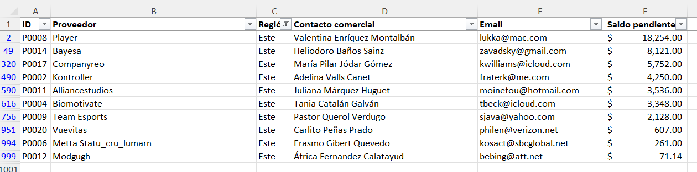

# 📊 Plantilla de Control de Saldos Pendientes de Proveedores con Gráfico Dinámico

Proyecto desarrollado en Microsoft Excel para la gestión de cuentas por pagar, segmentación geográfica de proveedores y visualización gráfica del nivel de endeudamiento por cuentas comerciales.

## 📂 Archivo del Proyecto
Puedes descargar el archivo `.xlsx` y utilizarlo o modificarlo según tus necesidades.

### Vista Previa de la Plantilla y Reporte Gráfico

### Vista Previa de Segmentación con Filtros

## 🧮 Funciones y Herramientas Utilizadas

Esta plantilla automatiza el análisis de pasivos comerciales combinando bases de datos estructuradas con herramientas de inteligencia de negocios nativas de Excel:

- **Gráfico de Columnas Agrupadas**: Inclusión de un componente de visualización dinámico ("Saldos Pendientes de Proveedores") que ordena automáticamente la información de mayor a menor para identificar los niveles de deuda más críticos de un vistazo.
- **Herramienta de Filtros Avanzados**: Configuración de encabezados con filtros activos para segmentar instantáneamente la base de datos completa por zonas o criterios específicos (como se observa en la extracción de la *Región Este*).
- **Formato Financiero de Datos**: Formateo profesional de saldos de cuenta (`$ #,##0.00`) y claves únicas de indexación (`ID`) para mantener la legibilidad y la integridad en auditorías rápidas.

## 📌 Objetivo

Proporcionar a los departamentos de contabilidad, finanzas y tesorería un panel de control visual y eficiente para supervisar las obligaciones financieras con terceros. Su diseño facilita la priorización de flujos de caja y permite analizar rápidamente la concentración de pasivos pendientes por proveedor y zona geográfica.
