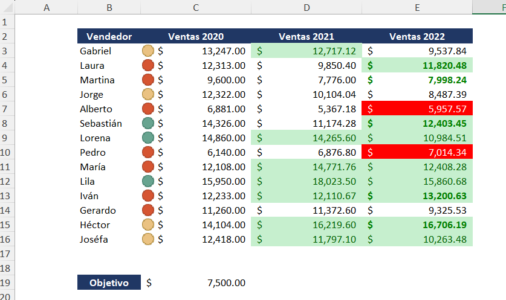

# 📊 Plantilla de Comparativa de Ventas Anuales y Seguimiento de Objetivos

Proyecto desarrollado en Microsoft Excel para el análisis comparativo del rendimiento de ventas por vendedor durante un periodo de tres años (2020-2022), integrando alertas visuales basadas en objetivos comerciales específicos.

### Vista Previa de la Plantilla

## 📂 Archivo del Proyecto
Puedes descargar el archivo `.xlsx` y utilizarlo o modificarlo según tus necesidades.

## 📌 Objetivo

Proporcionar a gerentes de ventas y coordinadores comerciales una herramienta visual y directa para evaluar el crecimiento o decrecimiento de su equipo a lo largo del tiempo. Su diseño permite detectar patrones de éxito y áreas de mejora de forma inmediata, facilitando la toma de decisiones basada en el cumplimiento de objetivos anuales.
