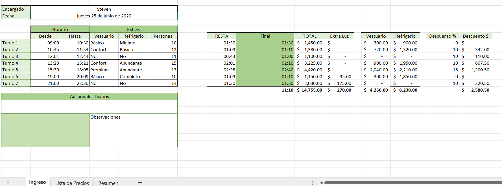
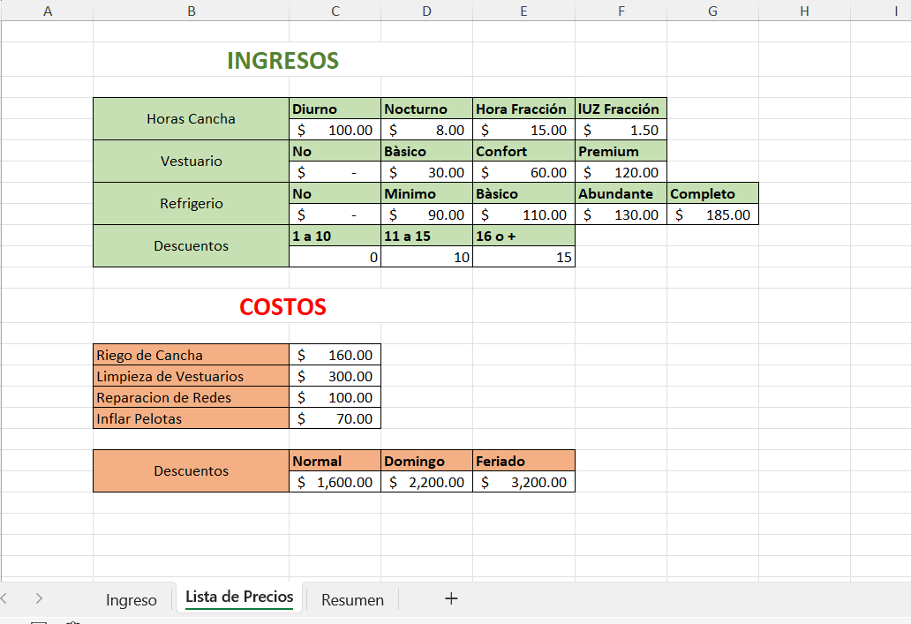
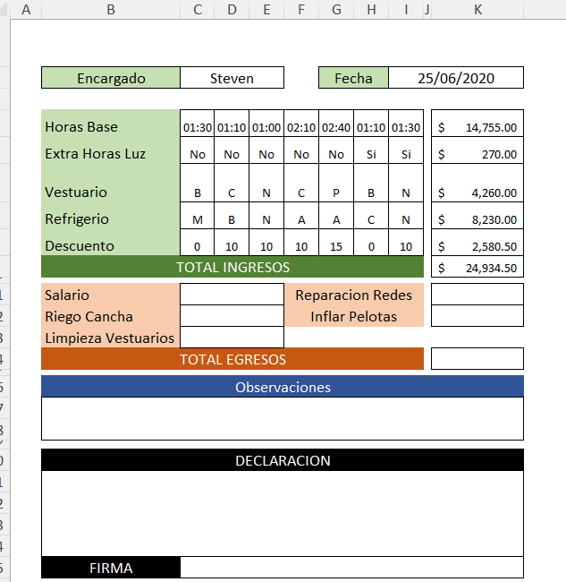

# 📊 Sistema de Control Financiero: Ingresos, Costos y Resumen Operativo

Proyecto avanzado desarrollado en Microsoft Excel para la gestión integral de un complejo operativo/deportivo, automatizando el registro de flujos de caja distribuidos por turnos diarios, listas de precios cruzadas y consolidación de egresos.

## 📂 Archivo del Proyecto
Puedes descargar el archivo `.xlsx` y adaptarlo o modificarlo según las necesidades operativas de tu negocio.

### Vista Previa del Sistema

## 📂 Archivo del Proyecto
Puedes descargar el archivo `.xlsx` y adaptarlo o modificarlo según las necesidades operativas de tu negocio.

## 📌 Objetivo

Proporcionar a administradores, encargados de caja y propietarios una herramienta robusta de auditoría interna que centralice la facturación diaria. Su diseño limpio e intuitivo en tonalidades verde sage y acentos corporativos mitiga los descuadres de efectivo, transparenta los costos operativos y agiliza los reportes financieros al final de cada jornada de trabajo.
